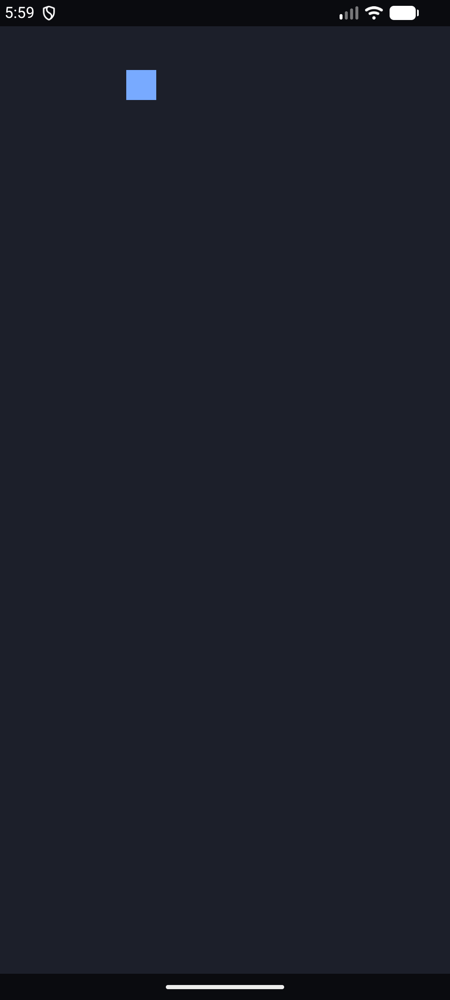

# skitter-app

**A sysl application on Android. Clone it, change two lines, write your program.**

```
git clone https://github.com/sysl-lang/skitter-app myapp
cd myapp
./skitter run
```

Then open `gradle.properties` and set the only two things that are yours:

```
skitter.applicationId=com.example.myapp
skitter.appName=My App
```

and write `program/main.sysl`. That is the whole of it — there is no name to change in the Gradle
build, none in the CMake, none in the manifest, and no JNI symbol to keep in step with a Scala class.
**If you are editing a name in any file other than `gradle.properties`, you are editing the wrong
file.**

## Building it

You need Android Studio's SDK with the **NDK** and **CMake** installed (SDK Manager → SDK Tools),
**`sbt`** on the path, and a **JDK between 17 and 25**.

```
./skitter run
```

builds, installs, launches, and follows the log. It is the whole loop, and it sets up its own
environment: it finds a JDK in range and the SDK itself, which are the two things that otherwise have
to be exported and whose absence is reported as something else entirely — a newer JDK fails inside
Gradle with a stack trace that never mentions a version, and a missing `ANDROID_HOME` surfaces as a
CMake toolchain error.

| | |
|---|---|
| `./skitter run` | build, install, launch, follow the log |
| `./skitter build` | just the debug APK |
| `./skitter install` | install what was last built |
| `./skitter log` | follow a running app's output |
| `./skitter release` | a release APK, signed if you have a key |
| `./skitter clean` | Gradle's output and sbt's |

**It is a script in the repository rather than something to install**, for the same reason `gradlew`
is one: a build you clone should not also need a tool fetched from somewhere else to drive it. Under
it is `./gradlew assembleDebug` and `adb`, and either can be run by hand:

```
export ANDROID_HOME=~/Library/Android/sdk
./fetch-sdl3.sh
./gradlew assembleDebug
adb install -r app/build/outputs/apk/debug/app-debug.apk
```

`fetch-sdl3.sh` downloads SDL3's official Android release into `app/libs/`. It is not committed:
tens of megabytes of binaries built against an NDK and an API level somebody else chose, and what
belongs in a repository is something a person can read.

**Android Studio uses its own bundled JDK** and is unaffected by the version rule; a terminal whose
`java` is newer needs `JAVA_HOME=<a jdk 17-25> ./gradlew assembleDebug`.

**It needs sysl 0.0.73 or newer.** 0.0.61 was the first that knew `aarch64-android` and 0.0.73 is the
first with transitive imports, which is what lets `program/package.hocon` name one coordinate.
`sysl targets` lists what a compiler has; if `aarch64-android` is not among them, the build stops at
`unknown target` and no amount of Android configuration will help.

An emulator works, and an **arm64** one is required — sysl has one Android target. On an Apple
Silicon machine the ordinary system images are arm64 already.

## What it does out of the box



A square bouncing inside the part of the screen the system bars leave. The lighter panel *is* that
region: the darker border along the top and bottom is the status bar and the navigation bar, which
is where a program laying itself out against the window's own size would have drawn and been
unreadable.

That is the demonstration, and it is deliberately small enough to delete.

## What you edit, and what you do not

| | |
|---|---|
| **`gradle.properties`** | your application id and its name. **Two lines** |
| **`program/main.sysl`** | your program |
| **`program/package.hocon`** | what your program depends on |
| everything else | Skitter's machinery — leave it, and drive it with `./skitter` |

**The machinery is not left alone out of politeness.** Four things in it are load-bearing and silent
when wrong, which is why they are somewhere you are not expected to look:

- **`-u SDL_main` in the CMake link options.** An archive member is pulled in only to resolve a
  symbol something already needs, and nothing in the `.so` calls `SDL_main` — Java looks it up by
  name at run time, long after the link. Without it the library builds, links, contains none of your
  program, and fails at `dlsym`. It is also what carries Skitter's JNI bridge in, since every sysl
  module compiles into one object in the archive.
- **The library must be called `main` and the symbol `SDL_main`.** They are `SDLActivity`'s defaults,
  and matching them is what keeps the two halves agreeing with nothing configured in between.
- **`--include-path sdl3=<dir>`, named rather than bare.** `sh.sysl.sdl3` declares a `pkg_config`
  requirement, and a cross build cannot run pkg-config for another machine. A bare `--include-path`
  adds a search path without answering the requirement.
- **`ANDROID_NDK_ROOT` handed to `sysl build-c`.** sysl takes the newest NDK it can find and AGP uses
  the `ndkVersion` pinned in `app/build.gradle.kts` — and a machine normally has two, because AGP
  downloads its own. Passing the one CMake is already using makes them the same by construction.

## Why your application id is free

**Before Skitter it was not.** The activity had to be renamed into each application's own package,
the JNI symbol was mangled from that package and written out by hand in sysl, and the manifest,
namespace, sbt project and jar name all had to agree — four spellings of one name kept in step
manually. What that produced, in a real repository in this org, was the string `bouncing` sitting in
a project that had nothing to do with bouncing, in a comment describing a symbol that did not exist.

**Skitter's activity lives in `sh.sysl.skitter` and stays there.** A launcher activity does not have
to be a class in the application's own package — `android:name` in the manifest takes any class on
the classpath, and the familiar `.MainActivity` is only a spelling relative to the package. So the
JNI symbol is a constant, the sysl half of the bridge lives in a library, and your `applicationId`
is a string nothing else reads.

## Adding an interface

The starter draws with SDL directly, which keeps it small. For real controls, add syslUI's driver to
`program/package.hocon` — one coordinate, because imports are transitive:

```
dependencies {
  skitter    { git = "github.com/sysl-lang/skitter",    version = "0.1.0" }
  syslui-sdl { git = "github.com/sysl-lang/syslui-sdl", version = "0.1.0" }
}
```

syslUI's driver owns its own window and frame loop and lays out against insets you hand it, so
forward Skitter's once you have them:

```
import sh.sysl.ui_sdl.{app, run, set_insets}
import sh.sysl.skitter.insets

@export("SDL_main")
sdl_main(argc: i32, argv: **u8) -> i32
    val ins = insets()

    set_insets(ins.left, ins.top, ins.right, ins.bottom)
    run(app("My App", () -> screen(), () -> 0x12141C))
    0
```

`sysl-lang/syslui-android` is a worked example of a form, a text area and a soft keyboard on a phone.

## The Java half is Scala, and you do not write any of it

There is no Java in this repository and no Kotlin either. `SkitterActivity` is Scala 3, it comes from
Skitter, and an application never subclasses or renames it.

**What it costs is a second build system.** The Android Gradle plugin compiles Java and Kotlin itself
and has no Scala support, so `activity/` is an sbt project and `app/build.gradle.kts` runs it as a
task and puts the jar on the classpath. `./gradlew assembleDebug` is still the one command; `sbt` has
to be installed.

**`minSdk` is 26 because of `scala-library`** — `d8` refuses to dex it below that. SDL's own floor is
21 and sysl's triple states 24; the three do not have to agree and the higher wins.

## One ABI

`arm64-v8a`, and that is not an apology. On an Apple Silicon host the emulator runs `arm64-v8a`, and
so does every Android device made since 2015 — one build covers both. `x86_64` matters only on an
Intel host or a CI runner, `armeabi-v7a` only for pre-2015 hardware; either is a line in
`app/build.gradle.kts` and a registry row in the compiler that does not exist yet.

## Licence

ISC. SDL3 is zlib and is not carried here.
